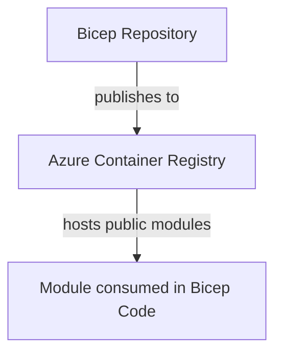

# Bicep Accelerator

This repository will contain Bicep modules as well as additional tooling to support document creation, and the deployment of ephemeral build agents for ADO or GHA.

This repository uses VSCode DevContainers to ensure that everyone is working with the same tool set. It also includes Linuxbrew to allow for extensibility.

This code publishes to the Azure Container Registry `slalombicepregistry.azurecr.io` where the code will be consumed.

