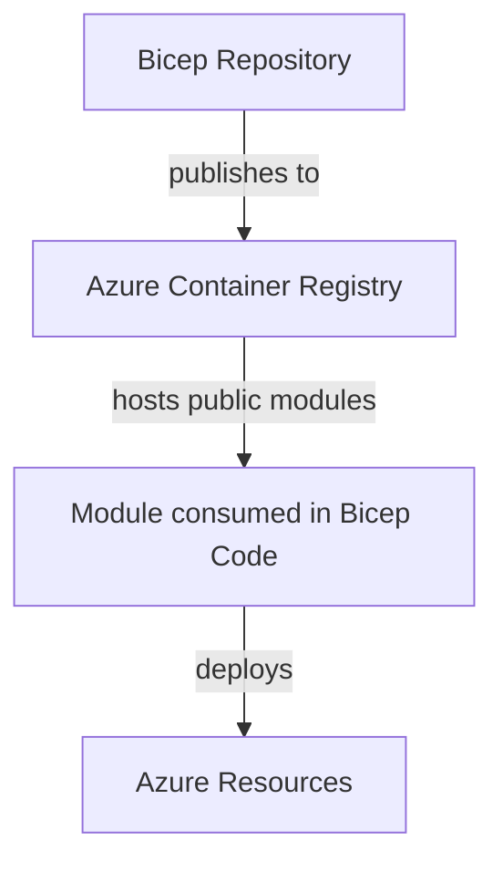

# Bicep Accelerator

This repository will contain Bicep modules as well as additional tooling to support document creation, and the deployment of ephemeral build agents for ADO or GHA.

This repository uses VSCode DevContainers to ensure that everyone is working with the same tool set. It also includes Linuxbrew to allow for extensibility.

This code publishes to the Azure Container Registry `slalombicepregistry.azurecr.io` where the code will be consumed.

Module documentation can be found in the wiki, or in the docs folder if you're a real geek and want the source code.

## Maintenance/Contribution

### Requirements (If not using the devcontainer)

- [PowerShell Core](https://learn.microsoft.com/en-us/powershell/scripting/install/installing-powershell)
  - Az Module
- [Azure CLI](https://learn.microsoft.com/en-us/cli/azure/install-azure-cli)
- [Azure Bicep](https://learn.microsoft.com/en-us/azure/azure-resource-manager/bicep/install#azure-cli)
- [Python](https://www.python.org/downloads/)
- [Pre-commit Framework](https://pre-commit.com/#install)

### Guidelines

If editing/contributing PowerShell scripts please use Join-Path to create file paths to allow for xplat resolution.

If adding/modifying modules, you likely won't have access to push to our container registry. This will ultimately be handled by GHA using the service principal to push the module to the repo at merge time. but this is a manual process at the time being.
